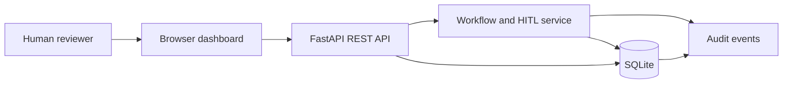
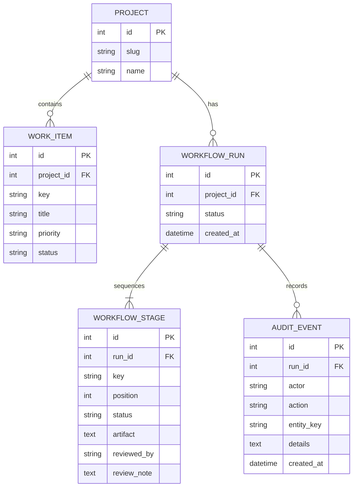

# Architecture

## Overview

The local application uses a same-origin vanilla JavaScript dashboard, FastAPI endpoints, SQLAlchemy 2.x persistence, and SQLite. No external assistant or SaaS connector is invoked. Phase artifacts are user/assistant-supplied text, and human review is a required state transition.

## Components
- `web/`: static dashboard for backlog, eight-stage status, artifact review, and event history.
- `src/codemie_caps/main.py`: app factory, API route definitions, and database lifecycle.
- `src/codemie_caps/workflow.py`: seed data, phase ordering, current-stage guard, and audit helper.
- `src/codemie_caps/models.py`: project, work-item, run, stage, and audit entities.
- `tests/`: API transition tests; optional real browser smoke test.

## Data model

## State and trust boundaries
Each run has one ordered stage per persona: analysis → planning → design → development → code review → testing → deployment → documentation. Only the first non-approved stage is mutable. A reviewer decision requires actor and note. Approval advances the pointer by approving exactly one stage; rejection keeps that stage current and permits a later resubmission. Artifacts are untrusted text and rendered as text in the dashboard. API validation limits payload sizes.

## Deployment / operations
- Local Python service: Uvicorn on loopback, SQLite file at `CODIEMIE_DATABASE_URL` (defaults to project root).
- Container: Docker Compose, database persisted using a named volume.
- Health: `GET /api/health`; OpenAPI: `/docs`.
- Schema bootstrap currently uses `create_all`; add Alembic migrations before evolving a shared/production database.

## Production follow-up
Add authentication and reviewer authorization, CSRF protections if cookie auth is used, database migrations/backups, structured logs and metrics, idempotency for SaaS writes, connector timeouts/retries, secret storage, retention policy, and immutable external audit storage. Scope tools and integrations per assistant role.
